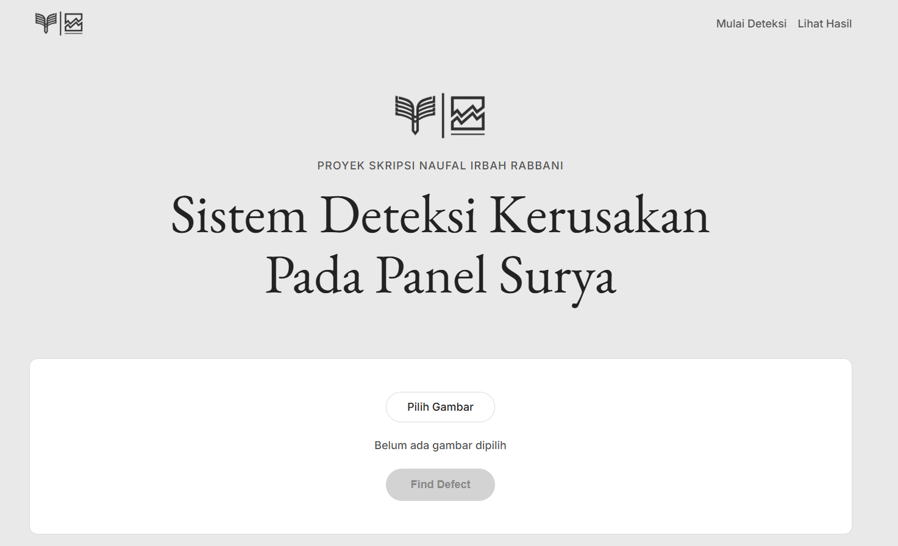
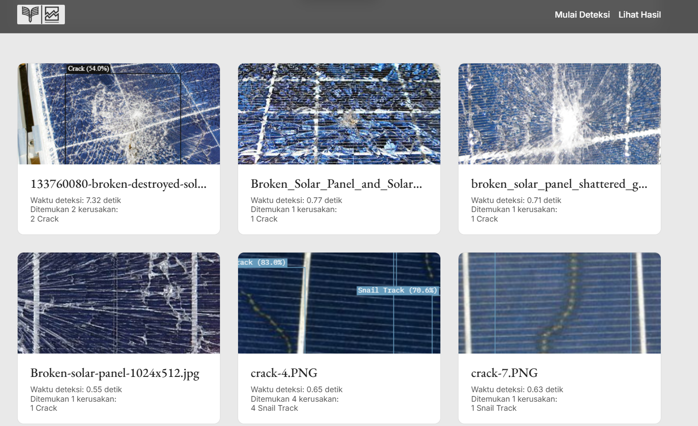
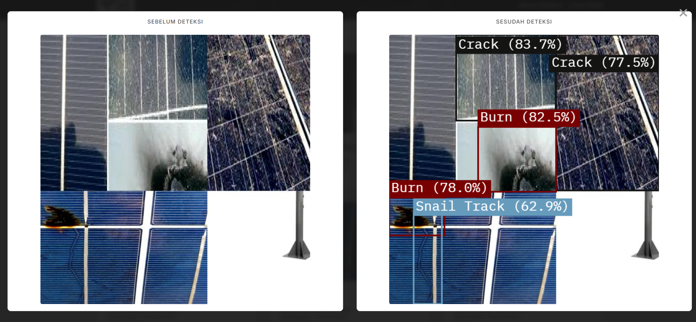
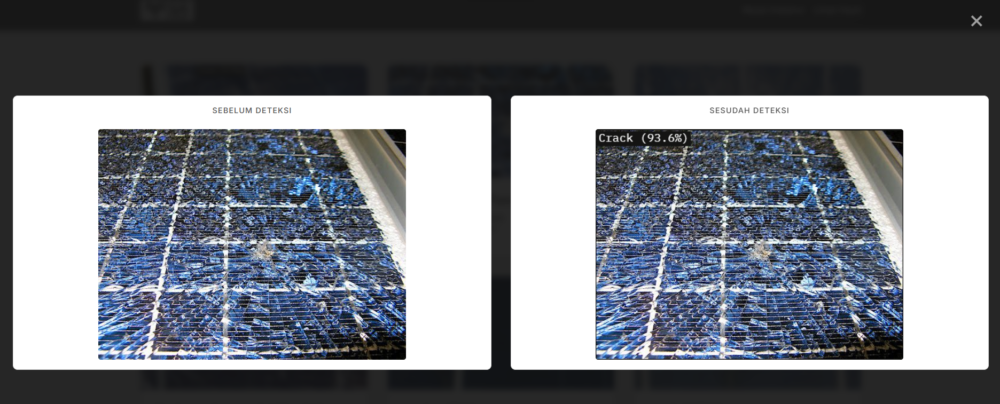
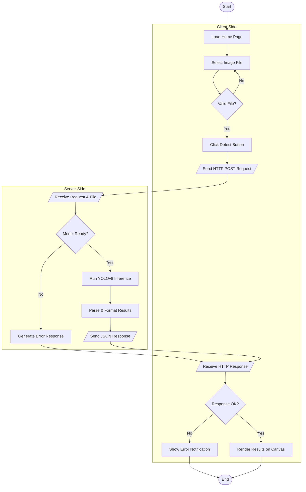

# Solar Panel Defect Detection System

> **Undergraduate Thesis Project** · Naufal Irbah Rabbani  
> Institut Teknologi PLN · 2025

An AI-powered web application for automatically detecting defects in solar panels using a **YOLOv8** model. The system identifies three types of defects — *crack*, *snail track*, and *burn mark* — and classifies panels in good condition as *non defective*.

---

## Preview

### Home Page


### Detection Result



---

## System Flowchart



---

## Project Structure

```
proyek_yolo/
│
├── 📄 README.md
├── 📄 .gitignore
├── 📄 requirements.txt
│
├── 📂 assets/                   # Screenshots for README
│   ├── preview-home.png
│   └── preview-result.png
│
├── 📂 .vscode/
│   └── launch.json
|   
|    📂 model/
│   └── best.pt
│
├── 📂 backend/
│   └── main.py                  # FastAPI server & /predict endpoint
│
└── 📂 frontend/
    ├── index.html
    ├── style.css
    ├── script.js
    └── 📂 assets/
        ├── logo.png
        ├── logod.png
        └── logox.png
```

## Tech Stack

| Component | Technology |
|---|---|
| Object Detection Model | YOLOv8 (Ultralytics) |
| Backend / API | FastAPI + Uvicorn |
| Frontend | HTML5, CSS3, Vanilla JavaScript |
| Image Processing | Pillow (PIL) |
| Result Visualization | HTML5 Canvas API |

---

## Detection Classes & Confidence Thresholds

| Label | Threshold | Description |
|---|---|---|
| `crack` | > 45% | Physical crack on the panel surface |
| `snail track` | > 20% | Snail trail / corrosion on cell lines |
| `burn` | > 20% | Burn mark on solar cell |
| `non defective` | > 50% | Panel in good condition |

---

## Getting Started

### 1. Clone the Repository

```bash
git clone https://github.com/<username>/proyek_yolo.git
cd proyek_yolo
```

### 2. Create a Virtual Environment

```bash
# Windows
python -m venv venv
venv\Scripts\activate

# macOS / Linux
python3 -m venv venv
source venv/bin/activate
```

### 3. Install Dependencies

```bash
pip install -r requirements.txt
```

### 4. Set Up the Model

Create a `model/` folder and place the `best.pt` file inside it:

```
proyek_yolo/
└── model/
    └── best.pt   ← place the model file here
```

### 5. Run the Server

```bash
# Run from the root folder proyek_yolo/
uvicorn backend.main:app --reload
```

### 6. Open in Browser

```
http://localhost:8000
```

---

## API Endpoints

| Method | Endpoint | Description |
|---|---|---|
| `GET` | `/` | Serves the main frontend page |
| `POST` | `/predict` | Upload an image and get detection results |

### Example Response `/predict`

```json
{
  "filename": "panel_01.jpg",
  "prediction_time": 0.43,
  "predictions": [
    {
      "label": "crack",
      "confidence": 0.8712,
      "box": [120, 85, 340, 290]
    },
    {
      "label": "burn",
      "confidence": 0.6503,
      "box": [400, 150, 510, 260]
    }
  ]
}
```

---

## License

This project was created solely for academic purposes (undergraduate thesis). Commercial use without written permission from the author is prohibited.

---

*© 2025 · Naufal Irbah Rabbani · Undergraduate Thesis*